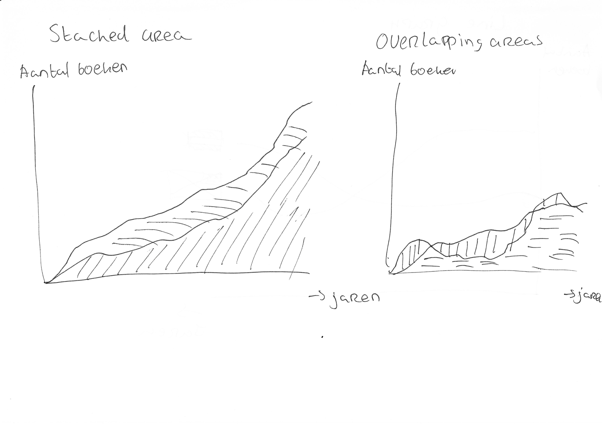
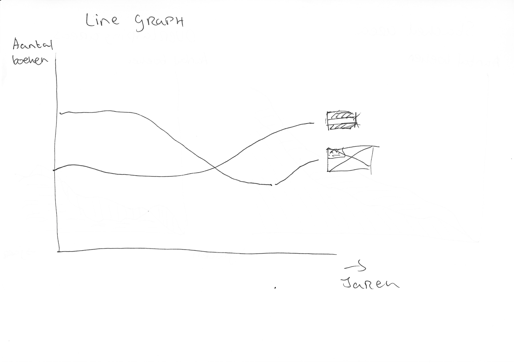

# Functional Programming

## Installing

*Clone the repository*

`git clone https://github.com/Maikxx/functional-programming.git`

*Navigate to the repository*

`cd functional-programming`

*Install the dependencies with either yarn or npm*

`yarn` / `npm install`

**Warning, read before executing**

Because of a bug in the `oba-api` dependency of the `node-oba-api-wrapper` I use to query for results, you will need to change the `baseUrl` variable, in the `index.js` of the `oba-api`, to be `const baseUrl = 'http://zoeken.oba.nl/api/v1/';`

This is very hacky, unfortunately, but there has been made a PR for this issue by a collegue of the HvA to change this. When this PR gets approved this issue will not be of relevance anymore and you can skip to the next step.

*Setup environment*

Copy the `.env.example` file and rename it to `.env`.
Then set a public and secret key for the OBA API to the corresponding variable.
Finally select the maximal age of books you wish to query for (Number).

Create a `nodemon.json` file in the root of the project and paste in the following:

```
    {
        "env": {
            "NODE_ENV": "development"
        }
    }
```

*Start the service*

`yarn serve` / `npm run serve`

## Research

The research for this assessment was done for Mark, employee of the OBA.
We had a briefing from Mark about the possibilities of this assessment last monday, where we also gained access to the search API of the OBA.

What he asked from us, was to make a data visualization from data that could be optained by querying the API.
I started writing down a lot of research questions and topics, after looking at the data that was available to us.
After having several research questions, I wrote down how I could split that question up in pieces, to make it more easy to solve.

I did this by thinking of a lot of sub questions per major topic.
The research questions and their sub questions can be found below.

### Research questions

1. How has the amount of different book genres published, in the past 15 years, changed?
    * What major book genres were published?
    * What major book genres became more popular?
    * What major book genres became less popular?
    * What are monumental increases and decreases?
    * How could these increases and decreases best be explained?
2. How has the amount of books that are rented out changed in the past 15 years?
    * How much books were rented out per year from the OBA?
    * How does this growth or decline in rented books compare to state in which books are in?
    * What are monumental increases and decreases?
    * How could these increases and decreases best be explained?
3. How has the amount of (cover) images on books changed in the past 15 years?
    * What is the average amount of cover images on books in a given year?
    * What are monumental increases and decreases?
    * How could these increases and decreases best be explained?
4. What is the relationship between title and description length of books?
    * What is the average title length for each year?
    * What is the average description length for each year?
    * How do these two variables relate?
    * What are monumental increases and decreases in title and / or description length?
    * How could these increases and decreases best be explained?
5. How has the division between Dutch and English study-books at the OBA changed in the past 15 years?
    * What is the amount of books in a given language per year?
    * Has this division increased or decreased?
    * What are monumental increases and decreases?
    * How could these increases and decreases best be explained?
    * _If available_: Does the increase or decrease have something to do with the increased amount of English   speaking people in Amsterdam?
    * Is this increase or decrease truthy for all books, not just for study-books?
6. How has the average age of authors in the children-book genre changed in the past 15 years?
    * What is the average age of authors of books in the children-book genre?
    * What are monumental increases and decreases?
    * How could these increases and decreases best be explained?
7. How does the amount of published books per year correlate with the amount of cover images in books?
    * How has the amount of cover images in books changed in the past 15 years?
    * How has the amount of published books changed in the past 15 years?
    * Is there an influence of the amount of cover images on books and the amount of books that are published?
8. How does the amount of published books per year correlate with average title and description length in books?
    * How has the length of titles and descriptions changed in the past 15 years?
    * How has the amount of published books changed in the past 15 years?
    * Is there an influence of the title/description length  onbooks and the amount of books that are published?
9. How does the amount of English speaking expats in Amsterdam correlate with the the amount of English books published?
    * How much English speaking expats are there in Amsterdam per year?
    * How has the amount of English books at the OBA changed in the past 15 years?

After having a lot of questions to choose from, I decided it was time to select one and start focussing on that one. I tried to pick a question which was interesting to me.

### Main research question

I choose the following **research question**:

_How has the division between Dutch and English study-books at the OBA changed in the past 15 years?_

The main reason this was interesting to me, was because I thought that I could combine this data with data of inhabitants of Amsterdam at a later point, to see why the graphq is as it is.

The **Sub questions** belonging to this research question are the following:

* What is the amount of books in a given language per year?
* Has this division increased or decreased?
* What years have monumental increases and decreases?
* How could these increases and decreases best be explained?
* _If available_: Does the increase or decrease have something to do with the increased amount of English speaking people in Amsterdam?
* Is this increase or decrease truthy for all books, not just for study-books?

After selecting these sub questions, I took a look at what **variables** I would need to solve them, which are:

* Language of a book
* Date of publication
* Genre of a book
* _If available_: nationality of the renter

While I was thinking of the variables required to solve this research question, I also thought of the hypothese, which would allow me to set an expectation for the visualization.

### Hypothese

_The amount of English books that are published per year has increased in the past fifteen years, while Dutch books are staying around the same amount._

I then looked up a lot of visualizations and decided to list the ones which were most appealing to me and which are possible for tackling the research questions hypothese. Which meant that it would need to show something over time, which in term ruled out a lot of visualization types. I decided to do a few quick and dirty sketches of what could possibly work.

### Possible visualisation types

* Multi line diagram
* Stacked area chart
* Stacked bar chart
* Multi bar chart
* Flowchart
* Multi area chart




### Choosen visualization type

After looking at the types I listed above, I went for the **stacked area chart**.
The main reason for this choice, was because I thought about the future, which would lead to maybe showing more languages in the visualization. I thought the stacked area chart was very much suited for this.

### Visualisation

Having choosen the type of the visualization, I started having a go at D3 in Observable.
The following graph is what I eventually came up with.
The graph would be way more intersting if there was not only data per year, but also per month that books are published, which would lead to the visuaization having more depth.
It would also be interesting to look at ways in which the visualization could have smooth edges instead of being blocky.

[Observable](https://beta.observablehq.com/d/ddabbcd1ef7a7741)

### Conclusions

The hypothese hypothese can be seen as partially true, because the amount of books that are published (and brought into the OBA) has increased a lot since 2003, however the correlation of the division between the languages is not true.
The division almost looks like it's 1:1 in some years, while in the most recent year (in this case 2018) the amount of English books at the OBA is more than double the amount of Dutch books.

**What does this tell me, one might ask?**

As I stated before, it is interesting to look for specific events in the graph and bind it to another data set, like the amount of expats that are living in Amsterdam, or the amount of foreign students in Amsterdam.
For now I have not bound these datasets, unfortunately, however the graph still shows multiple strange peaks and valleys.

For example, take a look at the major increase in English books, published in 2008, owned by the OBA. The reason behind this weird peak is unknown, but feel free to take a guess.

Also note the valley created by the decrease in Dutch books, that are published in 2014, owned by the OBA.

### Final words

* The sample size of 500 Dutch and 500 English books during a period of 15 years is really low, so to really get some meaning out of this graph you would need to sample a ton more books.
* Adding other languages will definately make it a more fun graph to watch.

## Process

### Summary

During these two weeks I mainly focussed myself on helping others, and finding help with others, mainly [Chelsea Doeleman](https://github.com/chelseadoeleman), [Linda de Haan](https://github.com/LindadeHaan) and [Jessie Mason](https://github.com/jessiemasonx).

These two weeks were more difficult for me than the **Frontend-Applications** weeks, because the API has proven itself to be quite a challenge to work with.
The fact that this was challenging, was mainly because I had not worked with API's (except for GraphQL) a lot until now.
The other reason was simply because the API gives back an overly complex datastructure.

To deal with this, I got a lot of help from mainly [Daniël](https://github.com/DanielvandeVelde), [Wouter](https://github.com/maanlamp) and [Chelsea](https://github.com/chelseadoeleman).

I used the paginated boilerplate from Wouter as a base for communicating with the OBA API, while using Daniëls great [README](https://github.com/DanielvandeVelde/functional-programming/blob/master/README.md) to help with the documentation.

Chelsea was a great help at generalizing complex data structures, to a way that it is more easy for me to write it.

Your daily dose of functional programming can be found in [this file](api/getters.js), which is where I wrote all my functions, which handle the getting of incoming data and transforming this data to D3 usable JSON.

It has been proven to be pretty tough to focus on both writing code, getting a deeper understanding in this data and visualizing this pretty much all at the same time.

I had hoped this concept of mine (languages of books at the OBA) could be combined with data of expats living in Amsterdam and the increase or decrease in that in the past years, unfortunately I ran out of time to do combine this.

I also found out that writing transformation code (for D3) before knowing what your client wants to have is not a good idea, since I needed to rewrite it multiple times over afterwards.

What I quickly realised after starting getting dependent of others peoples code, was that when something breaks, you will have to help them find the fix, otherwise you are stuck as well.

In the end, I have gotten to like this style of writing a lot, it keeps things (like [index.js](index.js)) very readable, while also gaining the ability to do some kind of type checking per function in JavaScript (I did not know [these kind of comments](api/getters.js) were possible).

It is still not as good as [TypeScript](https://www.typescriptlang.org) in my opinion though. 👀

_The longer log of my process can be found [here](docs/PROCESS.md)!_

## Development

### Tools

* [Nodemon](https://nodemon.io)
* [Yarn](https://yarnpkg.com/en/)

### Packages

**Disclaimer**

I know I could have written my own code for this lodash package, but why would I reinvent the wheel.

* [lodash.range](https://www.npmjs.com/package/lodash.range) - Used for creating an array of intermediate values by passing two values to this function.

## Future enhancements

* Convert everything to TypeScript.
* Add more languages like French and German.
* Bind this data with data about the nationalities of citizens living in Amsterdam (GDPR-friendly?).
* Convert the D3 to client side code instead of Observable, so it can receive dynamic data from the server.
* Add animations to the visualization.
* Request a larger time frame than 15 years.
* Enable more requests to be processed efficiently, so that the limit can go way higher.

## Honourable mentions

* [Folkert-Jan](https://github.com/FJvdPol):
    Folkert-Jan created the [boilerplate](https://github.com/FJvdPol/functional-programming/blob/master/oba-api.js) for communicating with the OBA API.
* [Daniël](https://github.com/DanielvandeVelde):
    Daniël helped me a lot by having a great [README](https://github.com/DanielvandeVelde/functional-programming/blob/master/README.md), which explained pretty much the whole OBA API in an easy way.
* [Wouter](https://github.com/maanlamp):
    Wouter created the [boilerplate for pagination](https://github.com/maanlamp/node-oba-api-wrapper) with the OBA API.
* [Chelsea](https://github.com/chelseadoeleman):
    Chelsea helped me get over my overly complex thinking and just getting stuff done.